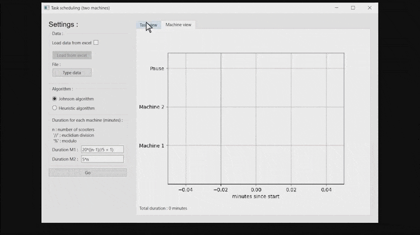

# Production Scheduling

We work in an electrical scooter factory, the production is divided in two steps : assembly with the first machine and packaging with the second. We are given a list of orders in input with the number of scooters by batch. Each batch must first be fully processed by the first machine before going through the second one. The processing time of both machines depends on the number of scooters in the batch.

This is scheduling a problem in a two-machine flow shop workshop. The main goal is to determine the optimal batch order so that production can be completed as soon as possible. 

## Overview

